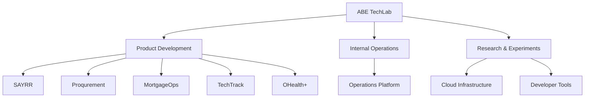

# 🧪 ABE TechLab

### A product studio for practical technology, systems, and experimentation.

**Turning ideas into products, internal systems, and useful technology.**

---

## 🧭 What is ABE TechLab?

ABE TechLab is the technology lab and product-studio layer behind a growing portfolio of software products, experiments, automation systems, and infrastructure work.

<table>
<tr><td width="33%" align="center">

### 🧱 Products
Build and validate real software products.

</td><td width="33%" align="center">

### ⚙️ Systems
Create internal tools and operational infrastructure.

</td><td width="33%" align="center">

### 🧠 Intelligence
Apply Artificial Intelligence (AI), automation, and research to practical problems.

</td></tr>
</table>

## 🔗 Product ecosystem

<strong>🧩 Working principles</strong>

- Build from a clear product problem.
- Separate product truth from prototype appearance.
- Document architecture before complexity grows.
- Prefer measurable, testable foundations.
- Treat security and operational reliability as product concerns.

## 🛠️ Technology landscape

JavaScript · TypeScript · React · Next.js · Node.js · Python · PostgreSQL · Supabase · Vercel · GitHub · Figma

## 📚 Repository purpose

This repository acts as the public-facing technology-lab workspace and documentation surface. Individual product repositories contain their own implementation details.

## 🔐 Ownership

ABE TechLab materials and software are proprietary unless a repository explicitly states another license. See [`LICENSE`](./LICENSE) for the terms applying to this repository.
